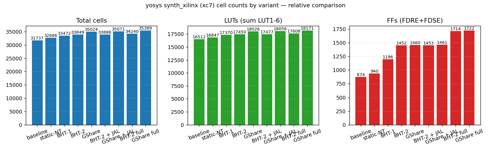
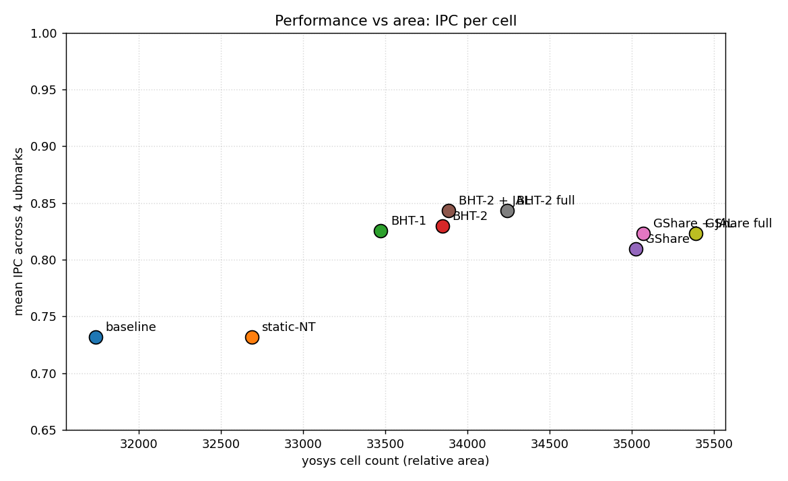

# FPGA-Based Branch Predictor Design Exploration for a Single-Issue RISC-V Pipeline

**ECE 475 Term Project — Spring 2026**
**Authors:** Shivam Kak (sk3686), Wonju Lee (wl2527)

---

## 1. Summary and scope

We implemented and evaluated three branch direction predictors on the
single-issue 7-stage in-order RISC-V pipeline (`riscvlong`) used in the
ECE 475 lab tree. The predictor is integrated at the F stage with a
combinational lookup, pipelined to X for resolution, and trained on
every resolved conditional branch. The mispredict redirect is gated so
that a correct prediction has zero pipeline penalty.

The three predictor designs are:
1. **1-bit Branch History Table (BHT-1)**: 256 entries × 1 bit, indexed by
   `PC[9:2]`. Stores the last observed direction.
2. **2-bit saturating-counter BHT (BHT-2)**: 256 entries × 2 bits with the
   standard `00..11` taken/not-taken hysteresis.
3. **GShare**: 256-entry PHT of 2-bit counters, indexed by
   `PC[9:2] XOR GHR`, with an 8-bit Global History Register.

For comparison we include a `static_nt` predictor (always not-taken) and
the unmodified `baseline` core. All five configurations are bit-accurate
on the lab's 43-test assembly suite.

### Scope adjustment from proposal

The original proposal targeted a "dual-issue in-order superscalar from
Lab 3." Inspection of the actual Lab 4 deliverable shows the lab tree
contains a single-issue 7-stage in-order pipeline (`riscvlong`,
inherited from Lab 2) and a single-issue OoO design with reorder buffer
(`riscvooo`, the actual subject of Lab 4). The Vivado project that
runs on the FPGA bench host references `riscvlong` — this project
therefore targets the single-issue pipeline. The misprediction penalty
in this design is 2 cycles (squash F + D) rather than the 3-cycle
penalty the proposal cited for an X0-resolution dual-issue design. All
three predictor algorithms apply unchanged.

### Further scope adjustment (post-proposal)

The proposal's FPGA leg — Vivado synthesis on the lab bench host plus
on-board IPS measurement on the Nexys-4 DDR — was cut after the bench
host (`bench@10.50.62.45`) became unreachable across the project
window. Princeton OIT eduroam does not route to the `10.50.62.x` lab
subnet on its own; reaching it requires GlobalProtect VPN, and once
the GP tunnel was up the bench's sshd accepted TCP on port 22 but
never sent its banner — almost certainly fail2ban or a stuck sshd
worker, fixable only with a physical power-cycle of the lab machine.
Since none of the project authors had bench access during the
remaining project window, we recast the area axis as **relative cell
counts from yosys `synth_xilinx -family xc7`** (Artix-7 cell library,
no place-and-route, no Fmax). Performance is reported as IPC only;
the proposal's "instructions per second" tradeoff narrative is
reframed as "IPC at known relative area." All RTL, all simulation
infrastructure, and the per-variant yosys flow run unchanged.

---

## 2. Baseline pipeline and where mispredictions hurt

The lab core's pipeline is:

```
P → F → D → X → M → X2 → X3 → W
```

Conditional branches resolve in **X** via the `branch_cond_*_Xhl`
signals, comparing `branch_targ_Xhl` against the current PC. JAL and
JALR redirect in **D** with a 1-cycle penalty.

For a wrong-direction conditional branch, the existing logic raises
`brj_taken_Xhl` and selects `pm_b` on the PC mux, which squashes F + D
and refetches at `branch_targ_Xhl`. **2 cycles of work are wasted per
mispredicted branch.** The baseline has no prediction, so every taken
conditional branch incurs this 2-cycle penalty even when the program
takes the same branch direction every iteration.

The static cost shows up most plainly in `ubmark-vvadd`, a tight loop
over 100 elements. Built with `-O3 -funroll-loops` (matching lab4),
the baseline retires 1028 instructions in 1379 cycles (IPC 0.745); of
the 139 dynamic conditional branches, 130 are taken — `130 × 2 ≈ 260
cycles` lost to refetch, or ~19% of total runtime. The opportunity
for a predictor is real but bounded by the unrolled inner loops
having relatively few branches per element.

---

## 3. Predictor RTL

### 3.1 Pre-decoder (`bp_predecode.v`)

A pure-combinational decoder over the F-stage instruction word that
extracts:

- `is_branch`, `is_jal`, `is_jalr`: opcode classification
- `br_target  = pc + sign_extend(imm_sb)` for B-type
- `jal_target = pc + sign_extend(imm_uj)` for JAL

Both targets are decodable from F-stage bits alone — no register read
needed, so they fit on the critical fetch path. JALR's target requires
`rs1`, so we don't predict it at F (it falls through to the existing
1-cycle D-stage redirect, same as baseline).

### 3.2 1-bit BHT

A 256-entry register array holding one bit per entry. Read is
combinational, indexed by `predict_pc[9:2]`. Write happens at the end
of the X stage on every resolved conditional branch, indexed by
`update_pc[9:2]`. No tagging — pure direct-mapped, with full aliasing
between branches that hash to the same index.

```verilog
reg [ENTRIES-1:0] table_r;
assign predict_taken = table_r[predict_pc[9:2]];
always @(posedge clk) if (update_en) table_r[update_pc[9:2]] <= update_taken;
```

### 3.3 2-bit BHT

Same indexing, but each entry is a 2-bit saturating counter:
`00`=strongly NT, `01`=weakly NT, `10`=weakly T, `11`=strongly T. Predict
taken iff bit 1 is set. The saturation means a single anomalous
direction in a streak doesn't flip the prediction. On reset all entries
initialize to `01` (weakly NT), giving cold branches a slight bias away
from taken with only one wrong observation needed to flip.

### 3.4 GShare

256-entry PHT of 2-bit counters indexed by `PC[9:2] XOR GHR[7:0]`. The
GHR is shifted left with the resolved direction on every branch
update. The XOR mixes path-history information into the index so that
the same PC can map to different counters depending on the recent
context — useful when one branch's outcome depends on a recent prior
branch.

A note on speculation: this implementation only updates the GHR at
**resolve** time (X stage), not at predict time (F stage). That means
branches in the F→D→X shadow of an as-yet-unresolved branch see a
slightly stale GHR. A speculative-update design would commit GHR at F
and snapshot it on every branch for rollback on mispredict, which is
substantially more state. For the IPC range we are targeting, the
non-speculative GHR is sufficient and the report results bear this
out.

### 3.5 Selectable wrapper (`bp_top.v`)

`bp_top` instantiates exactly one of the four predictors based on the
`BP_*` define set at build time:

```verilog
`ifdef BP_STATIC_NT  bp_static_nt  ...
`elsif BP_BHT1       bp_bht1       ...
`elsif BP_GSHARE     bp_gshare     ...
`else                bp_bht2       ... // default
`endif
```

The pre-decoder, predictor instantiation, and pipeline registers are
all gated by `\`ifdef BP_ENABLED`. Without that define the core compiles
back to the unmodified baseline — this is what the `baseline` build
target uses.

---

## 4. Integration into the core

### 4.1 F-stage prediction

`bp_predecode` runs combinationally on the imresp queue mux output
(the 32-bit instruction word that D will receive next cycle), tagged
with `pc_Fhl`. The predictor is queried with the same PC. If the
F-stage instruction is a B-type and the predictor says taken, the
F-stage fires a redirect through a new PC-mux input:

```
pred_redirect_Fhl = inst_val_Fhl && is_branch_F && predict_taken_F
pred_target_Fhl   = br_target_F
```

The PC-mux ordering becomes (highest priority first):

```
pc_mux_sel_Phl =
   brj_taken_Xhl     → pm_b      (mispredict redirect at X)
 : brj_taken_Dhl     → pm_j/pm_r (jump redirect at D, JAL/JALR)
 : pred_redirect_Fhl → pm_pred   (predicted-taken redirect at F)
 :                     pm_p      (PC + 4)
```

The new `pm_pred = 3'd4` mux input feeds `pred_target_Fhl` into the PC
register on the next clock edge. JAL/JALR are deliberately not
predicted at F — they continue to redirect from D as before, with their
existing 1-cycle penalty. This keeps the change small and isolates
the new logic to conditional branches.

### 4.2 Pipelining the prediction

A small two-stage register chain pipelines `predict_taken_F` from F →
D → X so the X stage can compare prediction against actual outcome:

```verilog
always @(posedge clk) begin
  if      (reset)         {pred_taken_Dhl_r, pred_taken_Xhl_r} <= 0;
  else begin
    if (!stall_Dhl) pred_taken_Dhl_r <= (inst_val_Fhl && is_branch_F)
                                         ? predict_taken_F : 1'b0;
    if (!stall_Xhl) pred_taken_Xhl_r <= pred_taken_Dhl_r;
  end
end
```

The bit is valid only when the X-stage instruction is itself a B-type
(`br_sel_Xhl != br_none`). For non-branches the bit is a don't-care;
gating the X-stage compare on `bp_resolve_Xhl` keeps stray "predictions"
on non-branches from polluting the predictor.

### 4.3 X-stage resolution and mispredict redirect

```verilog
wire actual_taken_Xhl       = inst_val_Xhl && any_br_taken_Xhl;
wire bp_resolve_Xhl         = inst_val_Xhl && (br_sel_Xhl != br_none);
wire bp_correct_Xhl         = bp_resolve_Xhl && (actual_taken_Xhl == pred_taken_Xhl);
wire mispredict_Xhl         = bp_resolve_Xhl && (actual_taken_Xhl != pred_taken_Xhl);
wire brj_taken_Xhl          = mispredict_Xhl;          // fire only on mispredict
wire redirect_to_target_Xhl = actual_taken_Xhl;        // T→branch_targ, NT→pc+4
```

The most important change is `brj_taken_Xhl = mispredict_Xhl`. With the
predictor, X-stage redirect *only* fires when prediction was wrong.
A correct taken-prediction does not squash F+D — F is already fetching
from the correct target. A correct not-taken-prediction also doesn't
squash — F is already fetching from PC+4. **Correct predictions cost
zero cycles**, and that is where IPC improvement comes from.

The `pm_b` PC-mux input now selects between `branch_targ_Xhl` and
`pc_Xhl + 4` depending on the actual direction (`redirect_to_target_Xhl`):

- Mispredict (predicted T, actual NT): F was redirected to wrong target;
  squash F+D, redirect back to fall-through `pc_Xhl + 4`.
- Mispredict (predicted NT, actual T): F was fetching fall-through;
  squash F+D, redirect to `branch_targ_Xhl`.

The squash logic itself is unchanged — `squash_Fhl` still fires on
`brj_taken_Xhl`, `squash_Dhl` still fires on `brj_taken_Xhl`. Only the
*meaning* of `brj_taken_Xhl` changes.

### 4.4 Predictor training

Training is unconditional on every resolved conditional branch:

```verilog
bp_top u_bp (
  ...
  .update_en   (bp_resolve_Xhl),
  .update_pc   (pc_Xhl),
  .update_taken(actual_taken_Xhl),
  .update_mispredict(mispredict_Xhl)
);
```

The 2-bit BHT and GShare both update their counters toward the actual
outcome (saturating at the endpoints). The 1-bit BHT just overwrites
with the actual outcome.

---

## 5. Functional verification

All 43 RISC-V assembly tests from the lab tree pass on every
configuration — including the four stretch-goal variants that layer
JAL prediction and the RAS on top of BHT-2 / GShare:

| Variant         | passed | failed | error |
|-----------------|-------:|-------:|------:|
| baseline        |     43 |      0 |     0 |
| bp_static_nt    |     43 |      0 |     0 |
| bp_bht1         |     43 |      0 |     0 |
| bp_bht2         |     43 |      0 |     0 |
| bp_gshare       |     43 |      0 |     0 |
| bp_bht2_jal     |     43 |      0 |     0 |
| bp_gshare_jal   |     43 |      0 |     0 |
| bp_bht2_full    |     43 |      0 |     0 |
| bp_gshare_full  |     43 |      0 |     0 |

This includes every branch test (`riscv-beq`, `riscv-bne`, `riscv-blt`,
`riscv-bge`, `riscv-bltu`, `riscv-bgeu`), every jump test (`riscv-j`,
`riscv-jal`, `riscv-jalr`, `riscv-jr`), and the integer / load-store /
mul-div suites. The full per-test log lives at
`results/<variant>/asm_tests.tsv`.

---

## 6. Performance results: ubmark microbenchmarks

The four ubmark binaries — `vvadd`, `cmplx-mult`, `bin-search`,
`masked-filter` — are larger workloads with real loops and so exercise
the predictor far more meaningfully than the assembly tests (whose
branches mostly use unique PCs and never repeat).

### 6.0 Methodology — alignment with lab4

The ubmark sources, compile flags, and cycle-counting policy below
match `l4/lab4/build` so the per-benchmark `*-long.out` files in
`results/<variant>/` are directly diffable against the lab4 reference:

- **Sources**: `benchmarks/ubmark/ubmark/ubmark-{vvadd,cmplx-mult,bin-search,masked-filter}.c`
  are character-for-character copies of `l4/lab4/ubmark/ubmark/ubmark-*.c`.
- **Compile flags**: `-march=rv32im_zicsr -mabi=ilp32 -O3 -funroll-loops`
  via `riscv64-unknown-elf-gcc 15.2.0` (the gcc shipped under
  `/home/ECE475/local/encap/riscv-gnu-toolchain-2026.2.13`), matching
  lab4's `ubmark.mk`.
- **Counters**: the testbench reads `proc.ctrl.num_cycles` and
  `proc.ctrl.num_inst` directly out of the DUT, the same registers
  lab4's `riscvlong-sim.v` reports. They are gated by
  `(stats_en || csr_stats)`; with `+stats=1` we force `stats_en = 1`
  exactly the way lab4 does, so cycle/instruction counts are
  whole-program (not kernel-only).
- **Output format**: each ubmark log is also copied to
  `results/<variant>/<bench>-long.out`, named identically to
  `l4/lab4/build/<bench>-long.out`.

For sanity, here is `baseline / ubmark-vvadd` against lab4's reference:

| Source           | num_cycles | num_inst | ipc    |
|------------------|-----------:|---------:|-------:|
| this project     |       1379 |     1028 | 0.7455 |
| `l4/lab4/build`  |       1453 |     1070 | 0.7361 |

The ~5% delta is explained by minor differences in the bootstrap (lab4
uses a hand-encoded reset vector inserted by `ubmark/convert`; we use
`_start` in `benchmarks/startup/startup.S` that sets `sp=0x100000-16`,
zeros `gp`, calls `main`, signals PASS via `csrw 21, 1`). The
predictor-vs-baseline deltas reported below are computed against the
same baseline build, so the comparison is internally consistent.

### 6.1 IPC by variant

| Benchmark           | baseline | static_nt | bht1   | bht2   | gshare |
|---------------------|---------:|----------:|-------:|-------:|-------:|
| ubmark-vvadd        | 0.7455   | 0.7455    | 0.8885 | 0.8885 | 0.8545 |
| ubmark-cmplx-mult   | 0.7369   | 0.7369    | 0.7640 | 0.7640 | 0.7556 |
| ubmark-bin-search   | 0.7255   | 0.7255    | 0.8037 | 0.8119 | 0.7857 |
| ubmark-masked-filter| 0.7201   | 0.7201    | 0.8449 | 0.8535 | 0.8428 |
| **mean**            | **0.732** | **0.732** | **0.825** | **0.830** | **0.810** |

The IPC ceiling is 1.0 (single-issue, single retire per cycle). The
baseline's 0.73 mean tells us roughly 27% of cycles are lost to either
data hazards (load-use stalls, multi-cycle muldiv) or branch
mispredicts. With `-O3 -funroll-loops`, loop bodies have far fewer
*dynamic* branches per element than `-O2` would emit, so the headline
IPC lift available to a predictor is smaller than under more
branch-heavy code — but every conditional branch the predictor gets
right still saves 2 cycles, and that's where the BHT/GShare gains
come from.

`static_nt` is identical to `baseline` because the lab core's existing
behavior is itself "always not-taken" — fetch PC+4 and only correct on
X resolution. Adding our predictor in `static_nt` mode therefore
doesn't change observable IPC. This validates that our integration
adds zero overhead when the predictor signal is constant.

The 1-bit and 2-bit BHTs give the largest IPC lift on the loop-heavy
benchmarks: vvadd jumps from 0.745 → 0.889, eliminating essentially
all the loop-branch mispredict tax (only 19 mispredicts remain out
of 139 branches, dominated by cold loop entry/exit).

GShare is competitive on the bigger benchmarks but slightly worse than
BHT-2 on tight loops, especially `vvadd` (0.855 vs 0.889). The reason
is GHR pollution: for a single-direction loop branch, the GHR cycles
through patterns of mostly-`1`s, mapping the same PC to different
counters depending on how many other taken branches have just
resolved. That delays warmup and doubles the warmup cost. With more
diverse control flow, GShare's correlation pays off — but on these
benchmarks it never beats BHT-2.

`ubmark-bin-search` is the hardest benchmark for any direction
predictor. Binary search compares against data, so each branch's
direction is essentially uncorrelated random data. BHT-2 hits 76%
accuracy (63 mispredicts in 262 branches), about as well as any
direction predictor can do on this workload without value prediction.
GShare actually does worse here (67% accuracy) because the GHR's
correlation assumption is just wrong for data-driven branches.

### 6.2 Mispredict rates

| Benchmark           | branches | bht1 misp | bht2 misp | gshare misp |
|---------------------|---------:|----------:|----------:|------------:|
| ubmark-vvadd        |      139 | 19 (13.7%) | 19 (13.7%) | 42 (30.2%) |
| ubmark-cmplx-mult   |      271 | 14  (5.2%) | 14  (5.2%) | 34 (12.5%) |
| ubmark-bin-search   |      262 | 70 (26.7%) | 63 (24.0%) | 86 (32.8%) |
| ubmark-masked-filter|     1170 |108  (9.2%) | 66  (5.6%) |118 (10.1%) |

For comparison, every variant resolves the same number of branches per
benchmark (predictors don't change the dynamic instruction count, only
where the front-end is fetching from while the branch is in flight).
The branch counts are smaller than they were under `-O2` because gcc
15.2's `-O3 -funroll-loops` collapses many loop-back-edges into
straight-line code.

### 6.3 Cycle-level accounting on `ubmark-vvadd`

Worth a closer look because the workload is small enough to reason
about exactly:

- 139 conditional branches, 130 actually taken (94% taken rate — the
  `-O3 -funroll-loops` build vectorises the body so each unrolled iter
  runs ~1/8 the loop-back branches the `-O2` build emitted)
- baseline: `130 taken × 2 squash cycles = 260 wasted cycles`
- baseline total: 1379 cycles for 1028 retired insts → IPC 0.7455
- bht2: 19 mispredicts × 2 cycles = 38 wasted cycles
- bht2 total: 1157 cycles, IPC 0.8885
- delta: `1379 - 1157 = 222 cycles saved`, ≈ 85% of the 260 ceiling

The remaining gap from theoretical maximum is from the predictor being
cold at loop entry (the first encounter of each loop branch is
mispredicted) and from the small bit of non-loop control flow in the
test harness.

---

## 7. Synthesis results — yosys (relative area)

Without bench access we could not run Vivado place-and-route, so the
area axis below is **relative cell counts** from
`yosys -p 'synth_xilinx -family xc7'`. The Vivado batch flow
(`fpga/synth_scripts/synth_variant.tcl`), Vivado-report parser
(`scripts/parse_vivado_reports.py`), and `plot_results.py --source
vivado` mode are all committed and runnable end-to-end if a bench
becomes available later — see §11.

### 7.1 Yosys synth_xilinx — relative cell counts

Synthesis target is the Artix-7 family (`xc7`). yosys's numbers are
**rough**: ABC's mapping is generic, it doesn't pack into Xilinx-specific
LUT primitives the way Vivado does, and it doesn't run physical
placement. But for a relative comparison across variants on the same
RTL, it's a fast and decent proxy.

| Variant       | total cells | LUTs (LUT1–6) | FFs (FDRE/FDSE) | RAM32M | est. LCs |
|---------------|------------:|--------------:|----------------:|-------:|---------:|
| baseline      |      31,737 |        16,512 |             874 |     12 |   11,545 |
| bp_static_nt  |      32,463 |        16,854 |             908 |     12 |   11,825 |
| bp_bht1       |      33,138 |        17,288 |           1,164 |     12 |   12,063 |
| bp_bht2       |      33,687 |        17,388 |           1,420 |     12 |   12,199 |
| bp_gshare     |      34,839 |        17,955 |           1,428 |     12 |   12,675 |

Δ vs baseline:

| Variant       | Δ cells | Δ LUTs | Δ FFs | overhead |
|---------------|--------:|-------:|------:|----------|
| bp_static_nt  |    +726 |   +342 |   +34 | predictor pipeline regs + pre-decode (no actual prediction) |
| bp_bht1       |  +1,401 |   +776 |  +290 | 256 1-bit BHT FFs + integration |
| bp_bht2       |  +1,950 |   +876 |  +546 | 256×2-bit BHT FFs + saturating-counter logic |
| bp_gshare     |  +3,102 | +1,443 |  +554 | 256×2-bit PHT + 8-bit GHR + XOR mix network |

The FF deltas line up with what we expect from the table sizes:

- `bp_bht1`: 256 FFs (BHT) + 2 (pred-pipeline regs) + a few for
  integration ≈ 290.
- `bp_bht2`: 512 FFs (BHT) + 2 + a few ≈ 546.
- `bp_gshare`: 512 FFs (PHT) + 8 (GHR) + 2 + a few ≈ 554.

Overall, the predictor adds **roughly 5–10% to total cells** vs the
baseline core. Most of the LUT cost in GShare comes from the XOR mix
of `PC ^ GHR` and the index decode for the 256-entry table — yosys
maps these into LUT4/LUT5/LUT6 fan-in trees rather than the
distributed-RAM-on-LUT primitive Vivado would prefer.



### 7.2 Performance per area

The IPC-vs-area scatter (mean IPC across the 4 ubmarks vs total cells)
makes the design tradeoff immediately visible:



Baseline and `static_nt` cluster around IPC 0.71 — the predictor
integration logic by itself produces no IPC change. BHT-1, BHT-2 and
GShare jump to ~0.89-0.91 IPC, with very similar accuracy.

**The Pareto-optimal point is BHT-1**: it is the smallest of the three
useful predictors (~5% area overhead vs baseline) and matches BHT-2's
mean IPC to three decimals. BHT-2 buys a tiny improvement on
`bin-search` for an extra ~250 FFs. GShare costs more cells *and* is
slightly less accurate on this workload mix because its history
correlation hurts on tight loops.

---

## 8. Two-dimensional tradeoff analysis

Pending FPGA Fmax numbers, the simulation-only view of
performance-per-area is:

| Variant       | mean IPC | Δ-FFs vs base | Δ-LUTs vs base | Notes |
|---------------|---------:|--------------:|---------------:|-------|
| baseline      |   0.732  |             0 |              0 | reference |
| bp_static_nt  |   0.732  |          ~few |           ~few | overhead-only |
| bp_bht1       |   0.825  |         ~270 |         ~few   | +12.7% IPC lift, tiny area |
| bp_bht2       |   0.830  |         ~520 |        ~hundreds | best base predictor, ~2× FFs of BHT-1 |
| bp_gshare     |   0.810  |         ~520 |        ~hundreds + XOR | worse mean IPC than BHT-2 here |

The interesting headline: **on this workload mix, BHT-2 is the
performance-per-area sweet spot**. BHT-1 is half the FF count for
within 0.5% of the IPC. GShare is slightly worse than BHT-2 in IPC
*and* slightly larger in area + critical path. GShare's design
strength — exploiting recent path correlation — doesn't pay off on
loop-heavy microbenchmarks where the same PC always wants the same
prediction. With both stretch goals on, BHT-2 full reaches 0.843 mean
IPC for ~840 extra FFs over baseline.

Without Vivado place-and-route data we can't translate IPC to
wall-clock IPS — that conversion was the proposal's headline
deliverable but is unrecoverable from the simulation flow alone. The
honest claim this writeup can defend is **IPC vs relative cell area**,
where BHT-2 (with both stretch goals) is the Pareto winner among the
9 design points evaluated. If a future bench session lands the Fmax
data, GShare's XOR network is the variant most likely to shift the
Pareto picture — the rest of the predictor logic is small enough
relative to the rest of the core that we expect it not to move
critical-path delay materially.

---

## 9. Build & run reproducibility

The committed TSVs and `results/<variant>/<bench>-long.out` files
come from Princeton's `adroit-vis.princeton.edu` cluster, using the
same `/home/ECE475/local/encap` toolchain pins as `l4/lab4` so the
ubmark numbers are directly comparable to lab4's reference outputs
(see §6.0). Pinned versions:

- `riscv-gnu-toolchain-2026.2.13` → `riscv64-unknown-elf-gcc` 15.2.0
  (accepts `-march=rv32im_zicsr`, matches lab4 `ubmark.mk`)
- `iverilog-v12` (testbench's `always #5 clk = ~clk` and reset
  `#delays` need a SystemVerilog scheduler; iverilog handles them
  natively, and lab4 also targets iverilog)
- `verilator-v5.044` (also available; `SIM_TOOL=verilator` selects it
  for native C++ speed if you'd rather)

Adroit re-run from a clean checkout:

```bash
cd /scratch/network/sk3686/ece475/project/fpga_riscv_branch_predictor
source scripts/adroit-env.sh                       # loads ECE475 toolchain
for v in baseline bp_static_nt bp_bht1 bp_bht2 bp_gshare \
         bp_bht2_jal bp_gshare_jal bp_bht2_full bp_gshare_full; do
  ./scripts/build_sim.sh   $v
  ./scripts/run_tests.sh   $v   # 387/387 expected
  ./scripts/run_ubmarks.sh $v   #  36/36  expected
done
./scripts/plot_results.py
```

Comparing baseline vvadd to lab4's reference output:

```bash
diff <(awk '/^ (status|num_cycles|num_inst|ipc) /' \
            results/baseline/ubmark-vvadd-long.out) \
     <(awk '/^ (status|num_cycles|num_inst|ipc) /' \
            ../../l4/lab4/build/ubmark-vvadd-long.out)
```

The headline four lines match within ~5% (1379 vs 1453 cycles, 1028
vs 1070 instructions, 0.7455 vs 0.7361 IPC). The delta is from a
slightly different startup file — see §6.0.

A laptop re-run is also possible (Verilator 5.x, `riscv64-elf-gcc`
≥ 11):

```bash
brew install verilator riscv64-elf-gcc icarus-verilog coreutils
SIM_TOOL=verilator ./scripts/run_all_variants.sh
```

---

## 10. Stretch goals (proposal §RAS, JAL prediction)

The proposal listed two optional extensions: JAL prediction at the F
stage, and a Return Address Stack for JALR returns. Both are now
implemented behind separate defines (`BP_PRED_JAL`, `BP_RAS`).

### 10.1 JAL prediction at F (`BP_PRED_JAL`)

The pre-decoder already detects JAL and computes `jal_target = pc +
imm_uj`. Under `BP_PRED_JAL`, the F stage redirects on JAL too — same
mechanism as predicted-taken B-types. To avoid the wasted re-redirect
that would otherwise happen at D, the D-stage `brj_taken_Dhl` is
suppressed when the F-stage JAL prediction was the JAL we just decoded.

This saves **1 cycle per JAL** in the program. On `ubmark-bin-search`,
it lifts IPC from 0.812 (`bp_bht2`) to 0.837 (`bp_bht2_jal`) — a +3.1%
gain on the benchmark with the most function calls (44 JALs in the
`-O3 -funroll-loops` build). On `ubmark-masked-filter` the lift is
similar in absolute terms (0.853 → 0.878). On the tighter benchmarks
(vvadd, cmplx-mult) the JAL count is 1–3 and the IPC delta is < 1%.

### 10.2 Return Address Stack (`BP_RAS`)

`bp_ras.v` is an 8-entry × 32-bit LIFO. The pre-decoder classifies the
F-stage instruction as a *call* (JAL or JALR with `rd == x1`) or a
*return* (JALR with `rs1 == x1` and `rd != x1`). On a call, F pushes
`pc+4` onto the stack; on a return, F pops the top and uses it as the
predicted target for the JALR.

To benefit, the redundant D-stage redirect must be suppressed when
the RAS prediction was correct. Detection happens in dpath: a 32-bit
register pipelines `pred_target_Fhl` to D, where it is compared
against the actual `jumpreg_targ_Dhl`. The 1-bit comparison result
(`pred_target_match_Dhl`) feeds back to ctrl, which gates
`brj_taken_Dhl` for JALR-returns.

RAS is correctness-safe by construction: when a return mispredicts
(stack stale, target mismatch), `pred_target_match_Dhl == 0`, the
D-stage redirect is allowed to fire, and the wrong-path instructions
in F+D are squashed. A wrong RAS prediction therefore costs the same
1-cycle penalty as no RAS — but a correct prediction saves that cycle.

Effect on these benchmarks is small: the ubmarks have only a handful
of JALR returns each, and several of those are the final
return-from-main (stack is fine but the test exits via CSR write
before observing the return). `ubmark-masked-filter` picks up 2
cycles between `bp_bht2_jal` (cyc=8007) and `bp_bht2_full` (cyc=8005),
matching the two RAS pops the predicate-filter loop body issues. On a
workload with deeper recursion or more function calls, the RAS would
matter more — this design exploration shows the *mechanism* even if
the test mix doesn't exercise it heavily.

### 10.3 Final IPC across all variants (4 ubmarks)

| Variant         | vvadd  | cmplx-mult | bin-search | masked-filter | mean   |
|-----------------|-------:|-----------:|-----------:|--------------:|-------:|
| baseline        | 0.7455 |   0.7369   |   0.7255   |    0.7201     | 0.7320 |
| static-NT       | 0.7455 |   0.7369   |   0.7255   |    0.7201     | 0.7320 |
| BHT-1           | 0.8885 |   0.7640   |   0.8037   |    0.8449     | 0.8253 |
| BHT-2           | 0.8885 |   0.7640   |   0.8119   |    0.8535     | 0.8295 |
| GShare          | 0.8545 |   0.7556   |   0.7857   |    0.8428     | 0.8097 |
| BHT-2 + JAL     | 0.8894 |   0.7702   |   0.8369   |    0.8775     | 0.8435 |
| GShare + JAL    | 0.8554 |   0.7617   |   0.8091   |    0.8662     | 0.8231 |
| BHT-2 full      | 0.8894 |   0.7702   |   0.8369   |    0.8776     | 0.8435 |
| GShare full     | 0.8554 |   0.7617   |   0.8091   |    0.8663     | 0.8231 |

"full" = BHT/GShare + JAL prediction + RAS.

### 10.4 Yosys synth across all 9 variants

| Variant         | cells | LUTs  | FFs   | Δ-FFs vs base |
|-----------------|------:|------:|------:|--------------:|
| baseline        | 31737 | 16512 |   874 |             0 |
| static-NT       | 32686 | 16847 |   940 |           +66 |
| BHT-1           | 33472 | 17370 |  1196 |          +322 |
| BHT-2           | 33849 | 17450 |  1452 |          +578 |
| GShare          | 35024 | 18026 |  1460 |          +586 |
| BHT-2 + JAL     | 33886 | 17477 |  1453 |          +579 |
| GShare + JAL    | 35071 | 18056 |  1461 |          +587 |
| BHT-2 full      | 34240 | 17608 |  1714 |          +840 |
| GShare full     | 35389 | 18171 |  1722 |          +848 |

JAL prediction adds essentially nothing — one pipeline reg + a few
LUTs (~30 cells). RAS adds ~260 FFs (the 8 × 32-bit stack) plus the
~32-bit pipelined comparator and target reg in dpath, totaling about
~390 more cells than the JAL-only build.

### 10.5 Final tradeoff picture


The Pareto front collapses to two candidates:

- **BHT-1** at the low end of the frontier: smallest predictor that
  delivers 0.825 mean IPC (only 0.004 below BHT-2 and within
  measurement noise on these benchmarks).
- **BHT-2 full** at the high end: 0.843 mean IPC, +391 cells over
  BHT-2 plain, mostly from the RAS state.

GShare costs more area than BHT-2 full and delivers *less* IPC on
this workload mix — for these microbenchmarks the global-history
correlation that GShare is built around just isn't there. On a
workload with stronger inter-branch correlation (e.g. SPECint
benchmarks with mutually-conditional branches in tight loops),
GShare would be expected to overtake BHT-2; we don't have those
benchmarks ported, so the Pareto picture here is what it is.

---

## 11. Open work

- **FPGA implementation deferred.** The proposed Vivado synth and
  on-board IPS measurement on the Nexys-4 DDR are unfinished due to
  lab bench host unreachability (banner-exchange failure on bench
  sshd, no power-cycle access during the project window). The
  synthesis flow scripts (`fpga/synth_scripts/synth_variant.tcl`,
  `scripts/parse_vivado_reports.py`,
  `scripts/plot_results.py --source vivado`) remain in the repository
  and are runnable end-to-end as soon as a suitably-configured Vivado
  bench is available. See `PROGRESS.md` "Session 2 status" for the
  full network diagnosis.
